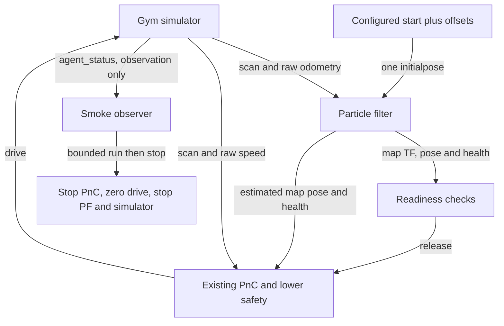
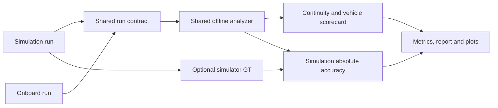

# Localization simulation and shared offline evaluation

## 1. How to use this document

This document explains the localization-enabled simulation architecture, readiness
contract, recorded evidence, metric definitions, and interpretation limits. Use the
[operational command reference](ROBORACER_OPERATIONAL_COMMAND_REFERENCE.md) for
copyable commands and [development environment](DEVELOPMENT_ENVIRONMENT.md) for
container/workspace setup. Start with the workflow below, then use sections 3–5
for recording, artifacts, and evaluation semantics.

## 2. Closed-loop localization workflow

The opt-in localization evaluation profile starts the existing Gym simulator, PF,
and full PnC stack, initializes PF once from the configured simulator start, and
checks 15 seconds of autonomous motion. It fixes clock/frame integration and uses
existing controller behavior, with simulator-GT-dependent recovery disabled.
PASS proves short-run startup and motion, not localization accuracy or racing robustness.
The perfect-localization and onboard defaults are unchanged. The shared offline
scorecard also analyzes onboard data without GT; see
[shared evaluation](#5-shared-simulationonboard-evaluation) for metrics, limitations
and comparison commands.

### 2.1 Reproduction

Use the [closed-loop smoke command](ROBORACER_OPERATIONAL_COMMAND_REFERENCE.md#7-closed-loop-localization-smoke-check)
and [essential regression checks](ROBORACER_OPERATIONAL_COMMAND_REFERENCE.md#6-essential-regression-checks).
The runner owns simulator, PF, and PnC launches in its ROS domain; do not combine
it with separately launched reference workflows. Exit 0 plus JSON `PASS` establishes
startup and bounded motion only. RViz is not a pass/fail source.

### 2.2 Readiness and acceptance

Each startup stage has `--startup-timeout-sec` (default 60); motion acquisition has
`--motion-timeout-sec` (default 15). No fixed startup sleeps are used.

1. Receive scan, raw odometry, and passive simulator status.
2. Start PF and wait for estimates and a matched initial-pose reader.
3. Send one `/initialpose` (`PoseWithCovarianceStamped`, `map` frame), using YAML
   `sx`, `sy`, `stheta` plus `--x-offset-m`, `--y-offset-m`, `--yaw-offset-rad`.
4. Receive more health updates than the configured manual-reset grace plus five;
   require a finite normalized map pose, usable PF health, and map-to-laser TF.
5. Start full PnC; verify lower-safety PF odometry, disabled GT gate, enabled
   arbitration PF-health gate, and absence of control/localization GT subscribers.
6. Require nonzero final command and actual speed, plus over 0.2 m displacement.
   During the configured interval, reject loss of required message flow, motion
   stalls longer than two seconds, lack of physical progress over two seconds,
   and critical child-process exits. Verify owned process groups exit on cleanup.

PF has no explicit initialization acknowledgement. Post-publication updates and
health provide operational readiness, not a pose-accuracy assertion. The runner
never repeatedly resets PF and does not subscribe GT to generate initialization.
Manual RViz `2D Pose Estimate` remains available in the original manual workflow;
do not manually reset PF during the automated smoke run.

### 2.3 Interfaces and evaluation profile

`oudtra_driver_bringup/config/localization_eval.yaml` is an explicit sparse overlay:

- Wall time throughout: the current Gym bridge publishes wall timestamps, no `/clock`.
- PF frame names have no leading slash; lower safety consumes `/pf/pose/odom`
  in `map`, matching raceline direction geometry. PF still consumes raw odometry.
- Planner uses the base profile's 0.40 s bounded scan-time TF wait instead of
  the perfect-localization adapter's 0.05 s. No latest-TF substitution is introduced.
- PF health remains required by arbitration. Wrong-way checks remain enabled.
- `enable_sim_reverse_swept_gate: false`; lower safety's GT topic points to an
  unused topic. Simulator truth is used only by the passive motion observer.

The existing `full_stack_sim_launch.py` accepts this file through its four
`*_platform_config` arguments. Its optional `use_sim_time` argument selects the
raceline publisher clock; the overlay selects the other node clocks. An empty
clock argument preserves the platform default. PF's `localize_sim_launch.py`
accepts optional `parameter_overlay`, applied last to PF/map/lifecycle nodes;
an empty overlay preserves the original launch defaults. The runner records
all exact launch commands in JSON. This workflow targets the IFAC map/raceline;
arbitrary-map support and accuracy evaluation are outside its contract.



GT-dependent reverse swept checks are disabled only in this profile. This short
check does not establish recovery performance, collision freedom, localization
accuracy, or suitability for competition deployment.

## 3. Recording a simulation evaluation run

### 3.1 Recording purpose and lifecycle

Optional recording preserves the same smoke run as a nine-topic rosbag plus phase
and configuration metadata. A separate offline command produces a scorecard,
`metrics.json`, and applicable engineering plots after shutdown. Smoke completion,
recording validity, and analysis validity are distinct; no localization performance
thresholds are imposed.

Use the maintained [recorded-run command](ROBORACER_OPERATIONAL_COMMAND_REFERENCE.md#8-record-and-analyze-an-evaluation-run)
to capture source revisions, start the same closed-loop workflow, and analyze it
offline. The revision strings identify source history; they do not prove installed
binaries are current.

Use a new directory each time; existing directories are rejected. Exit 0 requires
both smoke PASS and successful recording. On failure, inspect the reason and logs;
partial data is retained. No evaluation interval exists if startup never reaches
RUNNING. The recorder is the only additional permitted passive GT subscriber.
Without `--record-dir`, the original smoke-only invocation remains supported.

After the runner exits, analysis reads the preserved bag directly without restarting
ROS nodes or replaying the bag. The operational reference owns the exact analysis
and repeatability commands.

`ANALYSIS PASS`/exit 0 means usable data was analyzed, not that accuracy is acceptable.
Missing essential data returns `ANALYSIS FAIL`/exit 1. Optional reference absence
produces `UNAVAILABLE_DATA` reference metrics and no reference plot. Onboard input
without GT is valid; absolute accuracy is `NOT_APPLICABLE`. Analysis requires the
sourced Foxy Python/message libraries, NumPy and Matplotlib already installed in
the canonical image; it does not require a live ROS graph. This Foxy image has no
`rosbag2_py`, so the analyzer reads uncompressed SQLite/CDR bags directly.

Open `oudtra_driver_bringup/runs/<run-id>/report.md` on the **host** to view the
scorecard and PNGs. The package is bind-mounted, so these are the same files.
Artifacts are ignored by Git:

```text
<run-id>/
  metadata.yaml       # revisions/state, phase timestamps, roles, settings, config hashes
  smoke_result.json
  rosbag/             # immutable raw SQLite/CDR record plus bag metadata
  config/             # copies of launched inputs, map and reference files
  logs/
  metrics.json
  report.md
  plots/              # GT/PF XY, position error, static reference vs GT
```

Reanalysis overwrites only generated analysis outputs. Preserve metadata/config and
bag together. Run the essential pytest command above after changes; its synthetic
CDR tests include known errors, angle wrap, gaps, reference segments, emergency
transitions, missing GT, and repeatable outputs. The shared schema and additional analysis commands are described below.

## 4. Preserved run artifacts and deliverables

Run data is written under the host checkout because `oudtra_driver_bringup` is
bind-mounted into the container. The container path and equivalent host path are:

```text
Container: /sim_ws/src/oudtra_driver_bringup/runs/<run-id>/
Host:      /home/mzhou/f1tenth_dev/oudtra_driver_bringup/runs/<run-id>/
```

Use a descriptive run ID such as `ifac_pf_closed_loop_localization_baseline_20260918T120000Z`; do not use a numeric-only directory name. For the current validated simulation example, open these files on the dev laptop:

```text
/home/mzhou/f1tenth_dev/oudtra_driver_bringup/runs/ifac_pf_closed_loop_smoothness_baseline_20260922T175959Z/report.md
/home/mzhou/f1tenth_dev/oudtra_driver_bringup/runs/ifac_pf_closed_loop_smoothness_baseline_20260922T175959Z/metrics.json
/home/mzhou/f1tenth_dev/oudtra_driver_bringup/runs/ifac_pf_closed_loop_smoothness_baseline_20260922T175959Z/plots/trajectory_xy.png
/home/mzhou/f1tenth_dev/oudtra_driver_bringup/runs/ifac_pf_closed_loop_smoothness_baseline_20260922T175959Z/plots/position_error.png
/home/mzhou/f1tenth_dev/oudtra_driver_bringup/runs/ifac_pf_closed_loop_smoothness_baseline_20260922T175959Z/plots/reference_trajectory.png
/home/mzhou/f1tenth_dev/oudtra_driver_bringup/runs/ifac_pf_closed_loop_smoothness_baseline_20260922T175959Z/plots/smoothness_oscillations.png
```

`report.md` is the human summary, `metrics.json` is the machine-readable result,
and `plots/` contains the generated figures. `metadata.yaml`, `config/`, `logs/`,
and `rosbag/` preserve provenance and raw evidence. The `runs/` directory is
intentionally ignored by Git; copy or archive a run explicitly if it must be
shared. From the host, list the latest deliverables with:

```bash
find /home/mzhou/f1tenth_dev/oudtra_driver_bringup/runs -maxdepth 3 \
  \( -name report.md -o -name metrics.json -o -name '*.png' \) -print
```

The temporary engineering handoff reports are separate files at the repository
root. Their descriptive filenames preserve the phase order, for example
`PHASE1_STEP3_2A_RECORDED_LOCALIZATION_BASELINE_REPORT.md`; they are not generated
run deliverables and remain uncommitted by default.

### 4.1 Recorded signal contract

`config/localization_recording.yaml` defines the semantic roles and topic/type
mapping, independent of control tuning. Record only this explicit list:

| Role | Topic | Interpretation |
| --- | --- | --- |
| Public estimated pose | `/pf/pose/odom` | PF map-frame base pose; timestamp is publication time. |
| Source-timed estimated pose | `/tf` | Analyze only `map -> ego_racecar/base_link`; identical PF pose stamped with input odometry time. |
| Localization health | `/pf/health` | Element 0: 1 GOOD, 2 DEGRADED, 3 INVALID; unstamped, bag receive time only. |
| Simulator truth/collision | `/simulator/agent_status` | `simulator/ego` true map/base XY/yaw and collision flag from Gym state. |
| Raw odometry | `/ego_racecar/odom` | PF input in its local odometry frame, not map GT; its body-twist `linear.x` and `angular.z` supply simulated forward-speed and yaw-rate evidence. |
| Static reference | `/raceline_path` | Recorded map-frame raceline; reliable/transient-local QoS. |
| Final command | `/drive` | Final speed/steering commanded into simulator. |
| Safety state | `/reactive_control_v2/lower_safety_status` | Exact `mode` value, including `EMERGENCY_STOP`. |
| Arbitration state | `/drive_arbitration_v2/status` | Selected mode, reasons, readiness context. |

No `/tf_static` is needed for direct map/base pose comparison. No scan, map topic,
particle cloud or visualization topics are recorded. Raw odometry, health, command
and arbitration support the shared consistency, availability and vehicle metrics
below; no PF-internal statistics are promoted to headline metrics. The public PF poses are cross-checked against source-timed TF values.

## 5. Shared simulation/onboard evaluation

### 5.1 Purpose and evidence model

One offline analyzer accepts simulation and onboard bags. It generates the
same scorecard structure with explicit evidence and applicability on every metric.
GT enables absolute localization accuracy; onboard pose/odometry agreement is
**consistency, not accuracy**. Vehicle tracking uses GT in simulation and estimated
map pose onboard; pace uses GT trajectory in simulation and local odometry onboard.
These different evidence sources are labelled and do not receive automatic deltas.
The passive onboard recorder now produces this same run-directory contract without
launching or mutating the vehicle stack. Tests and a controlled ROS graph validate
the software path; no current artifact is a physical onboard measurement. Use the
[Terminal 4 procedure](ROBORACER_OPERATIONAL_COMMAND_REFERENCE.md#5-onboard-stack-and-passive-measurement)
for maintained commands.

The existing smoke startup, control profile, recording topic set and PASS/FAIL
contract are unchanged. Analysis never feeds a localization or control node.



Simulation vehicle metrics also retain their labelled GT trajectory evidence.
No GT input is required for the onboard branch.

### 5.2 Input and output contract

The directory stays `metadata.yaml`, `rosbag/`, optional `config/` and `logs/`,
then generated `metrics.json`, `report.md`, `plots/`. Raw inputs are not rewritten.
Input metadata schema 1 is adapted for existing recorded runs; schema 2 is the
explicit shared contract. Output metrics use schema 2 (a deliberate JSON breaking
change from the original scalar/null fields). Existing simulation definitions remain.

Schema 2 metadata requires `platform: sim|onboard`, `roles`, and either existing
`phases` with RUNNING/EVALUATION_END wall/monotonic stamps or an explicit `interval`
with integer `start_wall_ns` and `end_wall_ns`. Explicit interval callers must ensure
source and bag times share that wall-clock domain. Optional `outcome.completed` is
boolean; legacy `smoke_result.result` is adapted. Optional startup phase events
SEND_INITIAL_POSE/LOCALIZATION_READY provide readiness timing. No readiness is
invented when events are absent. `run_id` preserves provenance; the directory name
provides the human artifact title, even when a legacy directory was renamed.

Roles configure ROS topic/type/frame and decoder fields. ROS libraries are needed
to decode CDR, but no running ROS nodes or bag replay are needed. Supported adapters:

| Role | Data / additional mapping |
| --- | --- |
| `estimated_pose` | `nav_msgs/msg/Odometry`, declared `frame`; source-stamped map/base pose |
| `source_pose` (optional legacy adapter) | `tf2_msgs/msg/TFMessage`, `parent`/`child`; takes precedence over public estimated pose and cross-checks pose values |
| `raw_odometry` | `nav_msgs/msg/Odometry`, local pose and declared `frame`; never treated as truth |
| `vehicle_state` | `nav_msgs/msg/Odometry` body twist; `velocity_frame: body`; `physical_time: true` only with verified physical source timing; `lateral_velocity_observed: true` required for lateral dynamics; `evidence` describes measurement/model provenance |
| `localization_health` | `std_msgs/msg/Float32MultiArray`, `index` (default 0), string-key `states` mapping; receive-time basis |
| `reference_path` | `nav_msgs/msg/Path`, declared map `frame`, unchanged ordered geometry; closure must be present as an actual final segment |
| `final_drive_command` | `ackermann_msgs/msg/AckermannDriveStamped`, source-stamped final speed/steering angle |
| `safety_status` | `diagnostic_msgs/msg/DiagnosticArray`, `status`, `state_key` (default mode), `emergency_state` (default EMERGENCY_STOP) |
| `control_status` | Same diagnostic adapter, plus explicit `autonomous_states` list |
| `ground_truth_pose` (optional) | Odometry with `frame`, or DiagnosticArray with `status`, `pose_keys` (default x_m/y_m/yaw_rad) |
| `collision_status` (optional) | DiagnosticArray with `status`, `collision_key` (default collision), true/false flag |

Multiple roles may decode the same topic without additional recording. A qualified
GT vehicle-state source can be mapped to `vehicle_state` through the supported
Odometry adapter; the current simulator diagnostic is not a physical-time velocity
source. Do not assert `physical_time: true` merely because a header exists.

Legacy role aliases (`health`, `truth`, `reference`, `command`, `safety`,
`arbitration`) and PF health/authority mapping remain supported. New algorithms
need not publish PF topics or duplicate pose TF. The existing simulation adapter
explicitly treats its odometry twist as body velocity with **unverified physical
timing**, despite the empty child frame. New onboard adapters must verify semantics.

Each metric has `status`, `value`, `unit`, `reason`, `evidence`, `method`,
`time_basis`, and optional coverage fraction. Statuses are:

- `AVAILABLE`: value supported by the stated evidence; partial observed counts
  retain coverage and lower-bound limitations.
- `NOT_APPLICABLE`: outside the evidence design, e.g. onboard absolute error without GT.
- `UNAVAILABLE_DATA`: applicable but absent/insufficient data or provenance.
- `ANALYSIS_ERROR`: malformed declared data or a violated type/frame/time contract.

Unavailable values are null, never zero. Missing optional data yields a partial
scorecard and exit 0. Malformed optional data marks affected metrics as errors,
retains unrelated results and exits 1. Invalid interval, unreadable bag or no usable
core estimated pose fails analysis. A PASS is data-analysis validity, not vehicle
performance acceptance. Counts with incomplete observation are lower bounds.

### 5.3 Scorecard definitions

Defaults are in `oudtra_driver_bringup/config/evaluation_analysis.yaml`. Effective
settings are written to every output. Existing bag `analysis` values override
package defaults; `--analysis-config <yaml>` overrides those; explicit timing CLI
options override the file. Thresholds define diagnostics only, not PF/PnC tuning.

Localization-specific terminology used by the scorecard:

| Term | Definition |
| --- | --- |
| Estimated map pose | PF estimate of vehicle position and heading in the global map frame. |
| Simulator ground truth (GT) | Gym's internal true vehicle pose, exposed only as passive evaluation evidence. |
| Raw odometry | Local motion/pose input to PF; it can drift and is not absolute truth. |
| Body frame | Coordinates fixed to the vehicle: x is forward and angular z is yaw rate. |
| Accuracy | Estimated global pose compared with independent GT. |
| Consistency | Agreement between PF and odometry motion; correlated evidence, not truth error. |
| Station / driven progress | Cumulative distance along the raw-odometry trajectory actually driven. It is a spatial coordinate, not publication time or raceline index. |
| Local trend | Slowly varying signal behavior fitted from the configured distance neighborhood. |
| Oscillation residual | Station-sampled signal minus its local trend. |
| Coverage | Fraction of relevant evidence that satisfied the metric's support and validity rules. |

The evaluation window is `[RUNNING, EVALUATION_END)`, excluding startup and shutdown.
Legacy wall and monotonic durations must agree within 0.05 s. Cleanup-only unstamped
zero commands outside this interval and its 0.20 s freshness history are excluded.
An unstamped command inside that interval is malformed, not silently retimestamped.

| Group | Metric definitions |
| --- | --- |
| Localization / Accuracy | Position [m] and absolute wrapped yaw [rad] p50/p95/max; source-pose sample weighting, GT interpolation across <=0.10 s, no extrapolation. Original simulation definitions retained. |
| Localization / Continuity | Flag adjacent pose increments exceeding `0.50 m + 10 m/s * dt` or `0.35 rad + 6 rad/s * dt`, only for dt <=0.20 s. Count transitions once; gaps are unknown. Largest position/yaw increment is reported regardless of flag. Resets may be legitimate discontinuities. |
| Localization / Availability | Union of valid `[receive_time, source_time + 0.50 s]` intervals, clipped to evaluation. Complement gives dropout intervals/count/longest [s], including boundary intervals. Readiness is initial-pose event to ready event [s]. Health states held <=0.50 s give durations/observed entries and unknown duration. |
| Localization / Consistency | Relative SE(2) pose increments over 0.50 s windows every 0.10 s, rotated into each source's starting body frame. Translation residual [m] and wrapped yaw residual [rad] p50/p95/max; no interpolation across gaps >0.20 s. Event threshold: 0.30 m or 0.25 rad; count observed entries separately from initial/after-gap exceedances. |
| Vehicle / Robustness | Declared completion, collision observed (not impact count), emergency entries/active-at-start/uncertain entries. Narrow commanded-motion stall: autonomous state, non-emergency, abs(command speed) >=0.50 m/s and abs(vehicle speed) <=0.10 m/s continuously >=2 s. Each input must be <=0.20 s old. Duration includes the initial qualifying 2 s. This cannot detect an unintended zero command without an intent signal. |
| Vehicle / Tracking | Distance to static reference segments [m] and absolute heading-to-segment-tangent [rad], p50/p95/max. Exclude degenerate segments and ambiguous tied headings. Changing reference is an error. Static reference deviation includes intentional obstacle avoidance. |
| Vehicle / Smoothness | Four distance-domain oscillation metrics: final speed command [m/s], final steering command [rad], vehicle forward speed [m/s], and vehicle yaw rate [rad/s]. Each reports RMS residual and P95 absolute residual around a local linear trend. Command rows describe requested behavior; vehicle-state rows describe simulated/measured response. Lower generally means less short-scale variation, without defining a performance threshold. |
| Vehicle / Pace | Sum trajectory segment lengths [m], with interpolated window endpoints and complete bounded-gap coverage; distance / elapsed evaluation seconds [m/s]. GT in sim, local odometry proxy onboard; no lap/sector timing yet. |

Smoothness first computes cumulative distance along the raw-odometry trajectory,
which provides the common sim/onboard driven-progress coordinate without using GT.
Each semantic signal is linearly resampled on a uniform 0.10 m station grid; raw
station gaps above 0.50 m remain unknown. At every supported station, a least-squares
local linear trend is fitted over a 1.00 m window. The signal minus that trend is the
oscillation residual. RMS describes typical residual amplitude; P95 means 95% of
absolute residuals are below that value. Coverage is the supported residual-grid
fraction of the driven interval. The method is deterministic for irregular source
sampling and does not use time derivatives or count chatter while the vehicle is
stationary. Settings are analysis-only and do not tune controllers.

Current simulation evidence maps final `/drive` speed and steering angle to the two
command metrics, and `/ego_racecar/odom` body-twist `linear.x` and `angular.z` to
forward-speed and yaw-rate metrics. The semantic roles allow future onboard mappings
to final Ackermann command, VESC-derived speed, and measured IMU yaw rate without
changing metric meaning. That onboard adapter is not implemented here.

Physical acceleration, jerk, and lateral acceleration remain secondary diagnostics.
When qualified evidence exists, they use a centered quadratic fit
`v(t+u)=c0+c1*u+c2*u²` over 0.50 s windows on a 0.10 s time grid: longitudinal
acceleration = c1 [m/s²], jerk = 2*c2 [m/s³], and lateral acceleration is
`d(v_y)/dt + v_x*r` [m/s²]. At least five unique samples, support >=0.40 s spanning
both halves, no gaps >0.10 s, and windows wholly inside evaluation are required.
They remain unavailable when timing or body-state evidence is insufficient; no
slip-free or wall-time substitute is silently used.

The legacy simulator advances fixed physics steps but stamps publications with wall
time. Therefore physical acceleration/jerk and lateral dynamics are **unavailable**
on this baseline. `/drive` acceleration/jerk/rate fields are unset zeros, not
measurements. The distance-domain command and body-twist oscillation metrics remain
usable, as does the commanded-motion stall metric.
Noisy or sparse data is rejected by support/gap rules; no missing interval is filled
with invented zero motion. Pose/odometry consistency is correlated evidence because
localization may consume the same odometry.

### 5.4 Compare completed runs

Use the maintained [offline comparison command](ROBORACER_OPERATIONAL_COMMAND_REFERENCE.md#10-compare-two-analyzed-runs)
after both source runs have successful schema-2 analysis. The comparison itself
uses plain Python/JSON, no ROS imports or live graph.

Output is `report.md` and `comparison.json` in the explicit separate output directory.
Never use a run directory as comparison output. Repeating the command deterministically
regenerates comparison outputs. Existing schema-1 outputs must be reanalyzed first.

For verified comparability, metadata may declare `comparison_identity` with
`scenario_id`, `reference_sha256`, `algorithm_id`, `algorithm_config_sha256`.
Use platform-independent algorithm/config identity, not a whole launch-profile hash;
platform adapters differ. Never invent values to unlock deltas. Existing revisions
and configuration hashes remain visible as provenance. Unknown legacy identity
suppresses deltas with a reason.

Rows align by semantic name; values/applicability remain side by side. Deltas are
right minus left (availability in percentage points), only for matching known
identity, settings, method, evidence, units and time basis. Incomplete coverage and
unequal-duration cumulative counts/distances suppress deltas. GT versus estimated
tracking has different evidence and receives no delta. Booleans/nested event summaries
are displayed without numerical differences. There is no composite score or causal
sim-versus-onboard performance claim.

### 5.5 Onboard recording contract

`config/onboard_localization_recording.yaml` is the explicit no-GT contract used by
`record_onboard_localization.py`. The recorder is an observer: it creates
subscriptions and a rosbag process, but no vehicle/control publishers, parameter
clients, launch processes, or PF initialization events. A bounded preflight requires
the semantic scorecard topics plus scan, VESC telemetry, measured VESC IMU, the
servo-command echo, and TF streams. `/initialpose` is optional because an event may
occur before the recorder joins; start Terminal 4 before initialization when retaining
that event matters.

| Evidence | Current onboard source | Meaning |
| --- | --- | --- |
| Estimated pose / health | `/pf/pose/odom`, `/pf/health` | PF map pose and published PF health. |
| Raw odometry | `/odom` | VESC-derived local pose and forward speed; odometry is not GT. |
| Static reference | `/raceline_path` | Latched map-frame raceline used for tracking evidence. |
| Final drive command | `/ackermann_cmd` | Output selected by `ackermann_mux` and consumed by `ackermann_to_vesc_node`; shared plant-input command evidence. |
| Upstream autonomous command | `/drive` | Lower-safety/PnC output before teleop/lock mux selection; retained for debugging, not the shared final-command role. |
| Safety / authority | `/reactive_control_v2/lower_safety_status`, `/drive_arbitration_v2/status` | Emergency state and selected autonomous controller mode. |
| Forward vehicle speed | `/odom` `twist.linear.x` | Derived from measured VESC motor RPM by `vesc_to_odom`. |
| Measured yaw rate | `/sensors/imu/raw` `angular_velocity.z` | VESC IMU measurement retained for the future split vehicle-state adapter. |
| Steering evidence | `/sensors/servo_position_command` | VESC driver's echo of commanded servo position; it is not physical steering feedback. |

The analyzer currently expects forward speed and yaw rate in one `vehicle_state`
adapter. The onboard contract deliberately does not map `/odom` model-derived
`twist.angular.z` as measured yaw rate. It therefore preserves `/odom` and the real
IMU separately; forward-speed/yaw-rate smoothness and stall detection remain
`UNAVAILABLE_DATA` until the split adapter is implemented. Command smoothness,
continuity, availability, consistency, estimated-pose tracking, and odometry-based
pace remain supported. Absolute localization accuracy is `NOT_APPLICABLE` without GT.

Every run records platform/run/time, evaluation boundaries, main/PF/f1tenth_system
Git revision and clean/dirty/unknown state, contract/tool hashes, preflight topic/type/
frame observations, message counts, and supplied map/image/raceline/config hashes.
Missing paths or Git facts remain explicitly unknown. Bags and generated run data
stay under the Git-ignored `oudtra_driver_bringup/runs/` after transfer.

### 5.6 Plots and validation artifacts

Keep GT/estimate XY and absolute-error time plots when GT exists, static-reference
XY when reference exists, one pose-increment disagreement time plot when supported,
and one four-panel smoothness-residual plot over driven progress when any headline
oscillation metric is available.
Onboard XY is labelled estimated pose; no absolute-error plot is fabricated.
All XY plots use equal scaling; time axes are elapsed evaluation seconds. The
smoothness plot shows residuals only: each evaluated signal minus its fitted local
trend. Zero follows the local trend; excursions show shorter-scale variation. Raw
signals and fitted trends are used by the analyzer but are not drawn.

Current host deliverables:

- Current simulation smoothness baseline: `oudtra_driver_bringup/runs/ifac_pf_closed_loop_smoothness_baseline_20260922T175959Z/`.
- **Synthetic, not onboard measurements:** `oudtra_driver_bringup/runs/synthetic_onboard_no_gt_contract_fixture/`.
- Schema/evidence comparison demonstration: `oudtra_driver_bringup/runs/sim_vs_synthetic_onboard_contract_comparison/`.

Open each directory's `report.md` in VS Code preview. Run scorecards link their
`plots/*.png`; machine results are `metrics.json` (runs) or `comparison.json`
(comparison). Prefix host paths with `/home/mzhou/f1tenth_dev/`; container equivalents
start `/sim_ws/src/`. These generated directories are Git-ignored and remain local.
