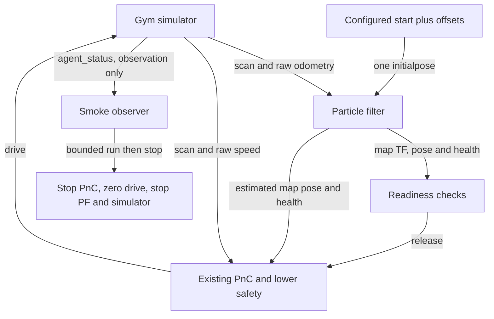

# Localization-enabled closed-loop smoke check

## Summary

The opt-in localization evaluation profile starts the existing Gym simulator, PF,
and full PnC stack, initializes PF once from the configured simulator start, and
checks 15 seconds of autonomous motion. It fixes clock/frame integration and uses
existing controller behavior, with simulator-GT-dependent recovery disabled.
PASS proves short-run startup and motion, not localization accuracy or racing robustness.
The perfect-localization and onboard defaults are unchanged.

## Manual commands from the dev laptop

Run the following in order. Keep the selected ROS domain exclusive to this run;
do not launch the separate reference workflows alongside it in that domain.

### 1. Open the canonical environment

In a **host terminal** on the dev laptop:

```bash
cd /home/mzhou/f1tenth_dev
./scripts/rr_container.sh status
./scripts/rr_container.sh shell
```

The remaining commands run **inside that container shell**. If status reports the
container is unavailable, follow [environment setup](DEVELOPMENT_ENVIRONMENT.md#2-localization-ready-simulation-environment).
The commands here use the existing container; they do not recreate it.

### 2. Build and source

```bash
source /opt/ros/foxy/setup.bash
cd /sim_ws
colcon build --packages-select f1tenth_gym_ros particle_filter centerline_tools path_following_v2 reactive_control_v2 drive_arbitration_v2 oudtra_driver_bringup
source install/local_setup.bash
```

Continue only after a successful build. For subsequent edits, build only affected
packages, then source again. In every new container shell, source both Foxy and
`/sim_ws/install/local_setup.bash` before using ROS commands.

### 3. Run or repeat the complete PF + PnC loop

```bash
ros2 run oudtra_driver_bringup run_localization_smoke.py \
  --sim-config /sim_ws/src/f1tenth_gym_ros/config/sim_ifac_roboracer.yaml \
  --run-duration-sec 15 \
  --result-json /tmp/localization_smoke.json
echo "Smoke exit code: $?"
cat /tmp/localization_smoke.json
```

This single command starts simulator, initializes PF once, releases the existing
PnC stack, checks motion, and stops its launches. Repeat the same command after
it exits to run a fresh check; the JSON file is overwritten, while each run has
its own log directory. Use a different `--result-json` filename to retain a result.

**Pass:** exit 0 and JSON `"result": "PASS"`. **Fail:** nonzero exit and a reason in
JSON (or terminal output for invalid arguments/configuration). Inspect the
`log_directory` recorded in JSON for simulator, PF, and PnC logs. These files are
inside the container and are temporary validation artifacts.

Use an unused ROS domain (`--ros-domain-id`, default 94). The runner owns its three
launch groups; it stops PnC, publishes zero drive until stationary, then stops PF
and simulator. To stop early, press **Ctrl-C in this container shell**; interrupted
runs are reported as FAIL and follow the same cleanup. Do not stop the container.
RViz retains its existing launch behavior and is not a pass/fail criterion.

### 4. Repeat the essential regression checks

In the same sourced container shell, from `/sim_ws`:

```bash
python3 -m pytest -q \
  src/particle_filter/test/test_launch_time_contracts.py \
  src/oudtra_driver_bringup/test
```

All tests must pass. These checks cover profile isolation, initialization inputs,
and existing launch/default contracts. They complement the motion check above;
unit-test success alone does not establish that the vehicle can drive.

To exercise bounded startup failure and cleanup after changing the runner:

```bash
ros2 run oudtra_driver_bringup run_localization_smoke.py \
  --sim-config /sim_ws/src/f1tenth_gym_ros/config/sim_ifac_roboracer.yaml \
  --startup-timeout-sec 0.001 \
  --result-json /tmp/localization_smoke_timeout.json
echo "Expected failure exit code: $?"
cat /tmp/localization_smoke_timeout.json
```

Expected: exit 1, JSON FAIL with `Timeout in WAIT_SCAN`, no cleanup error, and
simulator shutdown return code 0. This intentionally failing scenario checks
failure handling; it is not an ordinary successful-drive run.

For the separate perfect-localization full-stack loop or manual PF-only workflow,
use the [canonical reference commands](DEVELOPMENT_ENVIRONMENT.md#canonical-simulation-workflows).
Do not combine those terminals with this runner: it already starts all three stacks.

## Readiness and acceptance

Each startup stage has `--startup-timeout-sec` (default 60); motion acquisition has
`--motion-timeout-sec` (default 15). No fixed startup sleeps are used.

1. Receive scan, raw odometry, and passive simulator status.
2. Start PF and wait for estimates and a matched initial-pose reader.
3. Send one `/initialpose` (`PoseWithCovarianceStamped`, `map` frame), using YAML
   `sx`, `sy`, `stheta` plus `--x-offset-m`, `--y-offset-m`, `--yaw-offset-rad`.
4. Receive more health updates than the configured manual-reset grace plus five;
   require a finite normalized map pose, usable PF health, and map-to-laser TF.
5. Start full PnC; verify lower-safety PF odometry, disabled GT gate, enabled
   arbitration PF-health gate, and absence of control/localization GT subscribers.
6. Require nonzero final command and actual speed, plus over 0.2 m displacement.
   During the configured interval, reject loss of required message flow, motion
   stalls longer than two seconds, lack of physical progress over two seconds,
   and critical child-process exits. Verify owned process groups exit on cleanup.

PF has no explicit initialization acknowledgement. Post-publication updates and
health provide operational readiness, not a pose-accuracy assertion. The runner
never repeatedly resets PF and does not subscribe GT to generate initialization.
Manual RViz `2D Pose Estimate` remains available in the original manual workflow;
do not manually reset PF during the automated smoke run.

## Interfaces and profile

`oudtra_driver_bringup/config/localization_eval.yaml` is an explicit sparse overlay:

- Wall time throughout: the current Gym bridge publishes wall timestamps, no `/clock`.
- PF frame names have no leading slash; lower safety consumes `/pf/pose/odom`
  in `map`, matching raceline direction geometry. PF still consumes raw odometry.
- Planner uses the base profile's 0.40 s bounded scan-time TF wait instead of
  the perfect-localization adapter's 0.05 s. No latest-TF substitution is introduced.
- PF health remains required by arbitration. Wrong-way checks remain enabled.
- `enable_sim_reverse_swept_gate: false`; lower safety's GT topic points to an
  unused topic. Simulator truth is used only by the passive motion observer.

The existing `full_stack_sim_launch.py` accepts this file through its four
`*_platform_config` arguments. Its optional `use_sim_time` argument selects the
raceline publisher clock; the overlay selects the other node clocks. An empty
clock argument preserves the platform default. PF's `localize_sim_launch.py`
accepts optional `parameter_overlay`, applied last to PF/map/lifecycle nodes;
an empty overlay preserves the original launch defaults. The runner records
all exact launch commands in JSON. This workflow targets the IFAC map/raceline;
arbitrary-map support and accuracy evaluation are outside its contract.



GT-dependent reverse swept checks are disabled only in this profile. This short
check does not establish recovery performance, collision freedom, localization
accuracy, or suitability for competition deployment.
