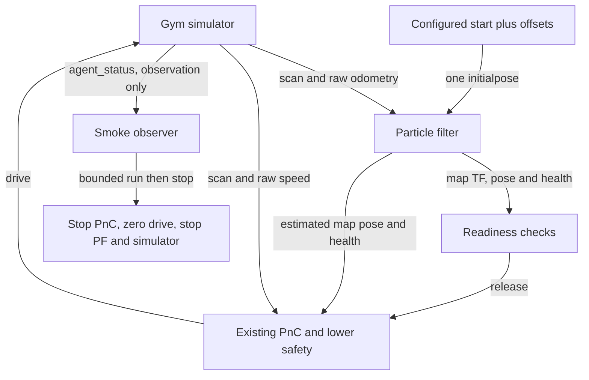

# Localization-enabled closed-loop smoke check

## Summary

The opt-in localization evaluation profile starts the existing Gym simulator, PF,
and full PnC stack, initializes PF once from the configured simulator start, and
checks 15 seconds of autonomous motion. It fixes clock/frame integration and uses
existing controller behavior, with simulator-GT-dependent recovery disabled.
PASS proves short-run startup and motion, not localization accuracy or racing robustness.
The perfect-localization and onboard defaults are unchanged.

## Run

Inside the existing `f1tenth_gym_ros_rocker` localization-ready container:

```bash
source /opt/ros/foxy/setup.bash
cd /sim_ws
colcon build --packages-select f1tenth_gym_ros particle_filter centerline_tools path_following_v2 reactive_control_v2 drive_arbitration_v2 oudtra_driver_bringup
source install/local_setup.bash
ros2 run oudtra_driver_bringup run_localization_smoke.py \
  --sim-config /sim_ws/src/f1tenth_gym_ros/config/sim_ifac_roboracer.yaml \
  --run-duration-sec 15 \
  --result-json /tmp/localization_smoke.json
```

Use an unused ROS domain (`--ros-domain-id`, default 94). Do not start additional
nodes in that domain during the check. The runner owns its three launch groups;
it stops PnC, publishes zero drive until stationary, then stops PF and simulator.
Ctrl-C follows the same cleanup. RViz retains its existing launch behavior and
is not a pass/fail criterion. Logs live in the `/tmp/localization_smoke_*` directory
identified in JSON. Exit 0 and `"result": "PASS"` indicate success; failures include
a reason and exit 1. Keep JSON and logs temporary unless explicitly needed.

## Readiness and acceptance

Each startup stage has `--startup-timeout-sec` (default 60); motion acquisition has
`--motion-timeout-sec` (default 15). No fixed startup sleeps are used.

1. Receive scan, raw odometry, and passive simulator status.
2. Start PF and wait for estimates and a matched initial-pose reader.
3. Send one `/initialpose` (`PoseWithCovarianceStamped`, `map` frame), using YAML
   `sx`, `sy`, `stheta` plus `--x-offset-m`, `--y-offset-m`, `--yaw-offset-rad`.
4. Receive more health updates than the configured manual-reset grace plus five;
   require a finite normalized map pose, usable PF health, and map-to-laser TF.
5. Start full PnC; verify lower-safety PF odometry, disabled GT gate, enabled
   arbitration PF-health gate, and absence of control/localization GT subscribers.
6. Require nonzero final command and actual speed, plus over 0.2 m displacement.
   During the configured interval, reject loss of required message flow, motion
   stalls longer than two seconds, lack of physical progress over two seconds,
   and critical child-process exits. Verify owned process groups exit on cleanup.

PF has no explicit initialization acknowledgement. Post-publication updates and
health provide operational readiness, not a pose-accuracy assertion. The runner
never repeatedly resets PF and does not subscribe GT to generate initialization.
Manual RViz `2D Pose Estimate` remains available in the original manual workflow;
do not manually reset PF during the automated smoke run.

## Interfaces and profile

`oudtra_driver_bringup/config/localization_eval.yaml` is an explicit sparse overlay:

- Wall time throughout: the current Gym bridge publishes wall timestamps, no `/clock`.
- PF frame names have no leading slash; lower safety consumes `/pf/pose/odom`
  in `map`, matching raceline direction geometry. PF still consumes raw odometry.
- Planner uses the base profile's 0.40 s bounded scan-time TF wait instead of
  the perfect-localization adapter's 0.05 s. No latest-TF substitution is introduced.
- PF health remains required by arbitration. Wrong-way checks remain enabled.
- `enable_sim_reverse_swept_gate: false`; lower safety's GT topic points to an
  unused topic. Simulator truth is used only by the passive motion observer.

The existing `full_stack_sim_launch.py` accepts this file through its four
`*_platform_config` arguments. Its optional `use_sim_time` argument selects the
raceline publisher clock; the overlay selects the other node clocks. An empty
clock argument preserves the platform default. PF's `localize_sim_launch.py`
accepts optional `parameter_overlay`, applied last to PF/map/lifecycle nodes;
an empty overlay preserves the original launch defaults. The runner records
all exact launch commands in JSON. This workflow targets the IFAC map/raceline;
arbitrary-map support and accuracy evaluation are outside its contract.



GT-dependent reverse swept checks are disabled only in this profile. This short
check does not establish recovery performance, collision freedom, localization
accuracy, or suitability for competition deployment.
