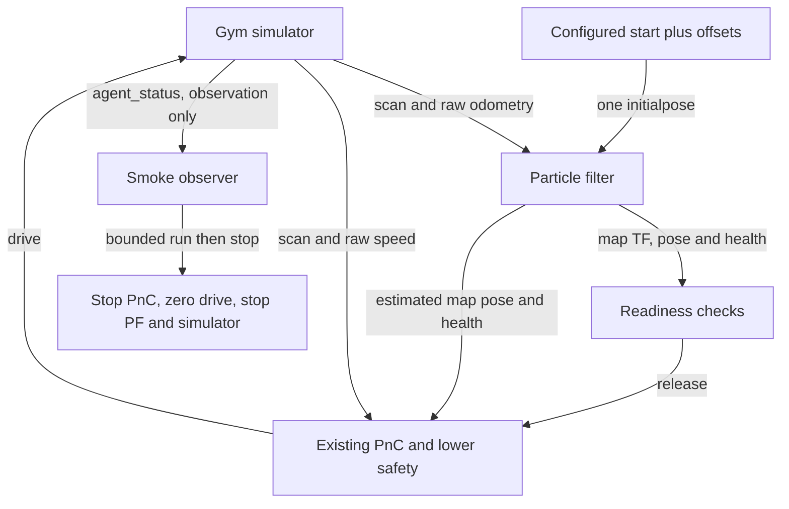
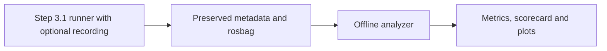

# Localization-enabled closed-loop smoke check

## Summary

The opt-in localization evaluation profile starts the existing Gym simulator, PF,
and full PnC stack, initializes PF once from the configured simulator start, and
checks 15 seconds of autonomous motion. It fixes clock/frame integration and uses
existing controller behavior, with simulator-GT-dependent recovery disabled.
PASS proves short-run startup and motion, not localization accuracy or racing robustness.
The perfect-localization and onboard defaults are unchanged.

## Manual commands from the dev laptop

Run the following in order. Keep the selected ROS domain exclusive to this run;
do not launch the separate reference workflows alongside it in that domain.

### 1. Open the canonical environment

In a **host terminal** on the dev laptop:

```bash
cd /home/mzhou/f1tenth_dev
./scripts/rr_container.sh status
./scripts/rr_container.sh shell
```

The remaining commands run **inside that container shell**. If status reports the
container is unavailable, follow [environment setup](DEVELOPMENT_ENVIRONMENT.md#2-localization-ready-simulation-environment).
The commands here use the existing container; they do not recreate it.

### 2. Build and source

```bash
source /opt/ros/foxy/setup.bash
cd /sim_ws
colcon build --packages-select f1tenth_gym_ros particle_filter centerline_tools path_following_v2 reactive_control_v2 drive_arbitration_v2 oudtra_driver_bringup
source install/local_setup.bash
```

Continue only after a successful build. For subsequent edits, build only affected
packages, then source again. In every new container shell, source both Foxy and
`/sim_ws/install/local_setup.bash` before using ROS commands.

### 3. Run or repeat the complete PF + PnC loop

```bash
ros2 run oudtra_driver_bringup run_localization_smoke.py \
  --sim-config /sim_ws/src/f1tenth_gym_ros/config/sim_ifac_roboracer.yaml \
  --run-duration-sec 15 \
  --result-json /tmp/localization_smoke.json
echo "Smoke exit code: $?"
cat /tmp/localization_smoke.json
```

This single command starts simulator, initializes PF once, releases the existing
PnC stack, checks motion, and stops its launches. Repeat the same command after
it exits to run a fresh check; the JSON file is overwritten, while each run has
its own log directory. Use a different `--result-json` filename to retain a result.

**Pass:** exit 0 and JSON `"result": "PASS"`. **Fail:** nonzero exit and a reason in
JSON (or terminal output for invalid arguments/configuration). Inspect the
`log_directory` recorded in JSON for simulator, PF, and PnC logs. These files are
inside the container and are temporary validation artifacts.

Use an unused ROS domain (`--ros-domain-id`, default 94). The runner owns its three
launch groups; it stops PnC, publishes zero drive until stationary, then stops PF
and simulator. To stop early, press **Ctrl-C in this container shell**; interrupted
runs are reported as FAIL and follow the same cleanup. Do not stop the container.
RViz retains its existing launch behavior and is not a pass/fail criterion.

### 4. Repeat the essential regression checks

In the same sourced container shell, from `/sim_ws`:

```bash
python3 -m pytest -q \
  src/particle_filter/test/test_launch_time_contracts.py \
  src/oudtra_driver_bringup/test
```

All tests must pass. These checks cover profile isolation, initialization inputs,
and existing launch/default contracts. They complement the motion check above;
unit-test success alone does not establish that the vehicle can drive.

To exercise bounded startup failure and cleanup after changing the runner:

```bash
ros2 run oudtra_driver_bringup run_localization_smoke.py \
  --sim-config /sim_ws/src/f1tenth_gym_ros/config/sim_ifac_roboracer.yaml \
  --startup-timeout-sec 0.001 \
  --result-json /tmp/localization_smoke_timeout.json
echo "Expected failure exit code: $?"
cat /tmp/localization_smoke_timeout.json
```

Expected: exit 1, JSON FAIL with `Timeout in WAIT_SCAN`, no cleanup error, and
simulator shutdown return code 0. This intentionally failing scenario checks
failure handling; it is not an ordinary successful-drive run.

For the separate perfect-localization full-stack loop or manual PF-only workflow,
use the [canonical reference commands](DEVELOPMENT_ENVIRONMENT.md#canonical-simulation-workflows).
Do not combine those terminals with this runner: it already starts all three stacks.

## Readiness and acceptance

Each startup stage has `--startup-timeout-sec` (default 60); motion acquisition has
`--motion-timeout-sec` (default 15). No fixed startup sleeps are used.

1. Receive scan, raw odometry, and passive simulator status.
2. Start PF and wait for estimates and a matched initial-pose reader.
3. Send one `/initialpose` (`PoseWithCovarianceStamped`, `map` frame), using YAML
   `sx`, `sy`, `stheta` plus `--x-offset-m`, `--y-offset-m`, `--yaw-offset-rad`.
4. Receive more health updates than the configured manual-reset grace plus five;
   require a finite normalized map pose, usable PF health, and map-to-laser TF.
5. Start full PnC; verify lower-safety PF odometry, disabled GT gate, enabled
   arbitration PF-health gate, and absence of control/localization GT subscribers.
6. Require nonzero final command and actual speed, plus over 0.2 m displacement.
   During the configured interval, reject loss of required message flow, motion
   stalls longer than two seconds, lack of physical progress over two seconds,
   and critical child-process exits. Verify owned process groups exit on cleanup.

PF has no explicit initialization acknowledgement. Post-publication updates and
health provide operational readiness, not a pose-accuracy assertion. The runner
never repeatedly resets PF and does not subscribe GT to generate initialization.
Manual RViz `2D Pose Estimate` remains available in the original manual workflow;
do not manually reset PF during the automated smoke run.

## Interfaces and profile

`oudtra_driver_bringup/config/localization_eval.yaml` is an explicit sparse overlay:

- Wall time throughout: the current Gym bridge publishes wall timestamps, no `/clock`.
- PF frame names have no leading slash; lower safety consumes `/pf/pose/odom`
  in `map`, matching raceline direction geometry. PF still consumes raw odometry.
- Planner uses the base profile's 0.40 s bounded scan-time TF wait instead of
  the perfect-localization adapter's 0.05 s. No latest-TF substitution is introduced.
- PF health remains required by arbitration. Wrong-way checks remain enabled.
- `enable_sim_reverse_swept_gate: false`; lower safety's GT topic points to an
  unused topic. Simulator truth is used only by the passive motion observer.

The existing `full_stack_sim_launch.py` accepts this file through its four
`*_platform_config` arguments. Its optional `use_sim_time` argument selects the
raceline publisher clock; the overlay selects the other node clocks. An empty
clock argument preserves the platform default. PF's `localize_sim_launch.py`
accepts optional `parameter_overlay`, applied last to PF/map/lifecycle nodes;
an empty overlay preserves the original launch defaults. The runner records
all exact launch commands in JSON. This workflow targets the IFAC map/raceline;
arbitrary-map support and accuracy evaluation are outside its contract.



GT-dependent reverse swept checks are disabled only in this profile. This short
check does not establish recovery performance, collision freedom, localization
accuracy, or suitability for competition deployment.

## Record one simulation measurement baseline

### Summary

Optional recording preserves the same smoke run as a nine-topic rosbag plus phase
and configuration metadata. A separate offline command produces a scorecard,
`metrics.json`, and three plots after shutdown. Smoke completion, recording validity,
and analysis validity are distinct; no localization performance thresholds are imposed.

From a **host terminal**, open the existing container with revision information
(the Git root is not mounted inside the container):

```bash
cd /home/mzhou/f1tenth_dev
git status --short
docker exec -it \
  -e ROBORACER_MAIN_REV="$(git rev-parse HEAD)" \
  -e ROBORACER_PF_REV="$(git -C particle_filter rev-parse HEAD)" \
  f1tenth_gym_ros_rocker bash
```

In that **container shell**, build/source as above, then run. Set `--source-state`
to `clean` or `dirty` when known from the host check; `unknown` is explicitly allowed.
The commits identify source history, not proof that installed binaries are current.

```bash
source /opt/ros/foxy/setup.bash
cd /sim_ws
colcon build --packages-select oudtra_driver_bringup
source install/local_setup.bash
RUN_DIR="/sim_ws/src/oudtra_driver_bringup/runs/$(date -u +%Y%m%dT%H%M%SZ)"
ros2 run oudtra_driver_bringup run_localization_smoke.py \
  --sim-config /sim_ws/src/f1tenth_gym_ros/config/sim_ifac_roboracer.yaml \
  --run-duration-sec 15 \
  --record-dir "$RUN_DIR" \
  --source-revision "$ROBORACER_MAIN_REV" \
  --pf-revision "$ROBORACER_PF_REV" \
  --source-state unknown \
  --result-json /tmp/localization_smoke.json
echo "Recording run exit code: $?"
cat "$RUN_DIR/smoke_result.json"
```

Use a new directory each time; existing directories are rejected. Exit 0 requires
both smoke PASS and successful recording. On failure, inspect the reason and logs;
partial data is retained. No evaluation interval exists if startup never reaches
RUNNING. The recorder is the only additional permitted passive GT subscriber.
Without `--record-dir`, the original smoke-only invocation remains supported.

After the runner exits, analyze **without restarting ROS nodes or replaying a bag**:

```bash
ros2 run oudtra_driver_bringup analyze_localization_run.py "$RUN_DIR"
cat "$RUN_DIR/report.md"
sha256sum "$RUN_DIR/metrics.json" "$RUN_DIR/report.md"
# Repeat the exact analysis; the two hashes should remain identical.
ros2 run oudtra_driver_bringup analyze_localization_run.py "$RUN_DIR"
sha256sum "$RUN_DIR/metrics.json" "$RUN_DIR/report.md"
```

`ANALYSIS PASS`/exit 0 means usable data was analyzed, not that accuracy is acceptable.
Missing essential data returns `ANALYSIS FAIL`/exit 1. Optional reference absence
produces unavailable reference metrics and no third plot. Analysis requires the
sourced Foxy Python/message libraries, NumPy and Matplotlib already installed in
the canonical image; it does not require a live ROS graph. This Foxy image has no
`rosbag2_py`, so the analyzer reads uncompressed SQLite/CDR bags directly.

Open `oudtra_driver_bringup/runs/<run-id>/report.md` on the **host** to view the
scorecard and PNGs. The package is bind-mounted, so these are the same files.
Artifacts are ignored by Git:

```text
<run-id>/
  metadata.yaml       # revisions/state, phase timestamps, roles, settings, config hashes
  smoke_result.json
  rosbag/             # immutable raw SQLite/CDR record plus bag metadata
  config/             # copies of launched inputs, map and reference files
  logs/
  metrics.json
  report.md
  plots/              # GT/PF XY, position error, static reference vs GT
```

Reanalysis overwrites only generated analysis outputs. Preserve metadata/config and
bag together. Run the essential pytest command above after changes; its synthetic
CDR tests include known errors, angle wrap, gaps, reference segments, emergency
transitions, missing GT, and repeatable outputs.

## Finding the engineering deliverables

Run data is written under the host checkout because `oudtra_driver_bringup` is
bind-mounted into the container. The container path and equivalent host path are:

```text
Container: /sim_ws/src/oudtra_driver_bringup/runs/<run-id>/
Host:      /home/mzhou/f1tenth_dev/oudtra_driver_bringup/runs/<run-id>/
```

Use a descriptive run ID such as `ifac_pf_closed_loop_localization_baseline_20260918T120000Z`; do not use a numeric-only directory name. For the validated baseline, open these files on the dev laptop:

```text
/home/mzhou/f1tenth_dev/oudtra_driver_bringup/runs/ifac_pf_closed_loop_localization_baseline_final/report.md
/home/mzhou/f1tenth_dev/oudtra_driver_bringup/runs/ifac_pf_closed_loop_localization_baseline_final/metrics.json
/home/mzhou/f1tenth_dev/oudtra_driver_bringup/runs/ifac_pf_closed_loop_localization_baseline_final/plots/trajectory_xy.png
/home/mzhou/f1tenth_dev/oudtra_driver_bringup/runs/ifac_pf_closed_loop_localization_baseline_final/plots/position_error.png
/home/mzhou/f1tenth_dev/oudtra_driver_bringup/runs/ifac_pf_closed_loop_localization_baseline_final/plots/reference_trajectory.png
```

`report.md` is the human summary, `metrics.json` is the machine-readable result,
and `plots/` contains the generated figures. `metadata.yaml`, `config/`, `logs/`,
and `rosbag/` preserve provenance and raw evidence. The `runs/` directory is
intentionally ignored by Git; copy or archive a run explicitly if it must be
shared. From the host, list the latest deliverables with:

```bash
find /home/mzhou/f1tenth_dev/oudtra_driver_bringup/runs -maxdepth 3 \
  \( -name report.md -o -name metrics.json -o -name '*.png' \) -print
```

The temporary engineering handoff reports are separate files at the repository
root. Their descriptive filenames preserve the phase order, for example
`PHASE1_STEP3_2A_RECORDED_LOCALIZATION_BASELINE_REPORT.md`; they are not generated
run deliverables and remain uncommitted by default.

### Recorded signal contract

`config/localization_recording.yaml` defines the semantic roles and topic/type
mapping, independent of control tuning. Record only this explicit list:

| Role | Topic | Interpretation |
| --- | --- | --- |
| Public estimated pose | `/pf/pose/odom` | PF map-frame base pose; timestamp is publication time. |
| Source-timed estimated pose | `/tf` | Analyze only `map -> ego_racecar/base_link`; identical PF pose stamped with input odometry time. |
| Localization health | `/pf/health` | Element 0: 1 GOOD, 2 DEGRADED, 3 INVALID; unstamped, bag receive time only. |
| Simulator truth/collision | `/simulator/agent_status` | `simulator/ego` true map/base XY/yaw and collision flag from Gym state. |
| Raw odometry | `/ego_racecar/odom` | PF input in its local odometry frame, not map GT. |
| Static reference | `/raceline_path` | Recorded map-frame raceline; reliable/transient-local QoS. |
| Final command | `/drive` | Final speed/steering commanded into simulator. |
| Safety state | `/reactive_control_v2/lower_safety_status` | Exact `mode` value, including `EMERGENCY_STOP`. |
| Arbitration state | `/drive_arbitration_v2/status` | Selected mode, reasons, readiness context. |

No `/tf_static` is needed for direct map/base pose comparison. No scan, map topic,
particle cloud or visualization topics are recorded. Raw odometry, health, command
and arbitration remain useful preserved context; they are not PF-internal headline
metrics. The public PF poses are cross-checked against source-timed TF values.

### Metric definitions and limits

The evaluation window is `[RUNNING, EVALUATION_END)`, after the smoke's observed
motion/displacement condition and before shutdown. Initialization, readiness,
first observed motion and cleanup also have timestamps. It is not a whole-run
metric including startup. Wall and monotonic durations must agree within 0.05 s.

- **Position and absolute wrapped yaw p50/p95/max:** sample-weighted PF errors
  against GT at PF TF source timestamps. Interpolate GT XY/shortest-arc yaw only
  across gaps <=0.10 s; no extrapolation. Report accepted/rejected coverage.
- **Temporal localization availability:** fraction of evaluation time covered by
  finite received PF TF poses with source age <=0.50 s. It is temporal availability,
  not an accuracy or health-quality score. Bag receive time represents delivery.
- **Distance and mean speed:** sum true XY segment lengths within the window,
  then divide by elapsed wall seconds. Totals become unavailable if GT coverage
  has gaps/invalid samples; partial observed distance remains in data quality.
  Gym's internal speed uses physics time, which can differ under system load.
- **Collision:** observed ego collision boolean, not impact count. Gaps make a
  negative observation uncertain. **Emergency stops:** exact safety-mode entries;
  repeated samples are not repeated events. Active-at-start and transitions with
  unknown predecessors are reported separately; status gaps >0.50 s limit counts.
- **Cross-track:** GT distance to segments of the unchanged recorded static
  raceline. This is reference deviation, not active reactive/detour tracking error.
  Missing/changing/invalid reference gives N/A. **Pose jumps:** deferred/N/A;
  no threshold is invented that could confuse real motion with jumps.

Timing bounds can be overridden with analyzer options `--max-gt-gap-sec`,
`--max-pose-age-sec`, and `--max-status-gap-sec`; effective settings are in outputs.
PF uses latest scan and odometry asynchronously, and GT is publication-stamped
latest Gym state. Source-timed comparison improves alignment but does not establish
ideal sensor synchronization. Sampling rates and coverage belong to each dataset;
short-run values are not general performance claims.


